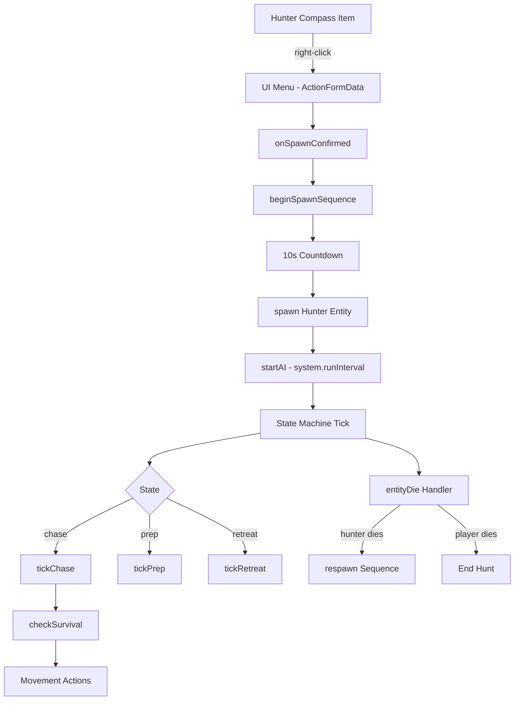
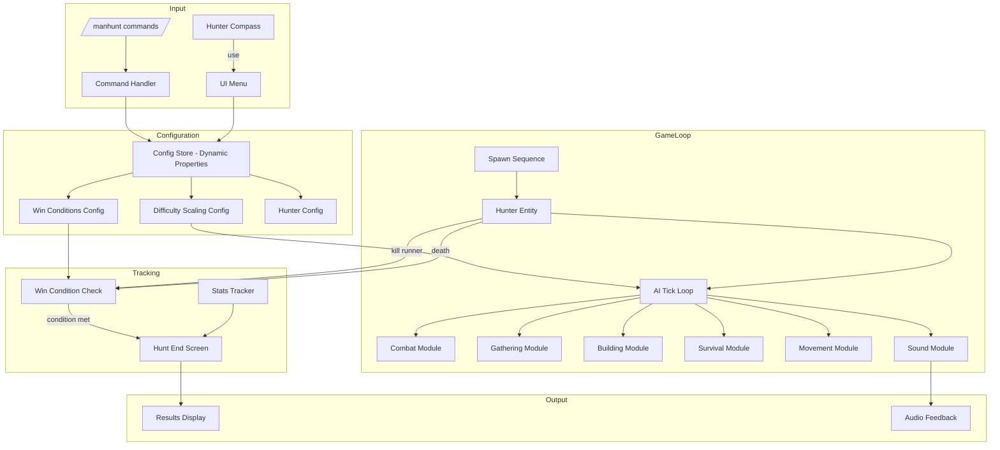

# Manhunt Bot v0.7.0 — Architecture & Implementation Plan

## Overview

v0.7.0 is a major feature release that transforms the Manhunt Bot from a single-runner chase simulator into a full-featured manhunt game mode with win conditions, multi-runner support, compass tracking, persistent configuration, and a proper sound system.

---

## Current Architecture (v0.6.0)



**File Map:**
| File | Lines | Responsibility |
|------|-------|---------------|
| `main.js` | 491 | Entry point, event wiring, spawn/despawn orchestration |
| `state_machine.js` | 1357 | AI tick loop, combat, survival, building, cooldowns |
| `movement.js` | 569 | Terrain checks, MLG, bridging, pillaring, parkour |
| `entity_manager.js` | 744 | Hunter lifecycle, spawn/respawn, bed tracking |
| `inventory.js` | 1038 | Virtual inventory, crafting, mining, equipment |
| `kits.js` | 198 | Creator kit definitions and matching |
| `ui.js` | 543 | ActionFormData menus, config management |

---

## v0.7.0 Feature Plan

### Priority 1 — Critical Fixes & Polish

#### 1.1 Version Alignment
- **Problem:** RP manifest is v0.7.0, BP manifest is v0.6.0 — mismatch breaks dependency resolution
- **Fix:** Bump BP manifest to `[0, 7, 0]` and update dependency UUID version references
- **Files:** [`BP/manifest.json`](BP/manifest.json:1), [`RP/manifest.json`](RP/manifest.json:1)

#### 1.2 Hunter Compass Tracking
- **Problem:** The compass is just a menu trigger — it doesn't actually point to the hunter
- **Solution:** Use `minecraft:lodestone_compass` component or script-based direction indicator
- **Implementation:**
  - When hunter is active, update compass `lodestone_pos` dynamic property to hunter location
  - Show distance in action bar when holding compass
  - Compass glows/pulses when hunter is within 50 blocks
- **Files:** [`BP/items/hunter_compass.json`](BP/items/hunter_compass.json:1), [`BP/scripts/main.js`](BP/scripts/main.js:1)

#### 1.3 Win Conditions System
- **Problem:** Hunter respawns infinitely — no way to "win"
- **Solution:** Configurable win conditions:
  - **Limited Lives:** Hunter has N lives (default 3), when exhausted → runner wins
  - **Time Limit:** Runner must survive T minutes (default 30), when expired → runner wins
  - **Kill Hunter N Times:** Runner wins after killing hunter N times
  - **Hunter Kills Runner:** Hunter wins immediately
- **New file:** [`BP/scripts/win_conditions.js`](BP/scripts/win_conditions.js)
- **UI:** Add win condition selector to spawn menu

### Priority 2 — Major Features

#### 2.1 Multi-Runner Support
- **Problem:** Only one target player — can't have multiple runners
- **Solution:** 
  - Track multiple target players in a `Set`
  - Hunter targets nearest non-sneaking runner
  - All runners share the same win/loss state
  - Each runner gets their own compass
  - Hunt ends when all runners are dead OR win condition met
- **Files:** [`BP/scripts/entity_manager.js`](BP/scripts/entity_manager.js:1), [`BP/scripts/state_machine.js`](BP/scripts/state_machine.js:1), [`BP/scripts/main.js`](BP/scripts/main.js:1)

#### 2.2 Difficulty Scaling
- **Problem:** Hunter stays same difficulty throughout the hunt
- **Solution:** Progressive difficulty that scales with:
  - Time elapsed (every 5 minutes → +1 difficulty tier)
  - Runner gear level (if runner has diamond → hunter gets iron minimum)
  - Death count (each hunter death → slightly more aggressive)
- **New file:** [`BP/scripts/difficulty_scaling.js`](BP/scripts/difficulty_scaling.js)
- **Config:** Add "scaling" toggle to UI (enabled/disabled)

#### 2.3 Portal Following
- **Problem:** Hunter can't follow through nether/end portals
- **Solution:**
  - Track when target changes dimension
  - Detect nearby portal blocks
  - Teleport hunter through portal after short delay
  - Handle both nether portal (standing in) and end portal (jumping in)
- **Files:** [`BP/scripts/movement.js`](BP/scripts/movement.js:1), [`BP/scripts/state_machine.js`](BP/scripts/state_machine.js:1)

### Priority 3 — Quality of Life

#### 3.1 Persistent Configuration
- **Problem:** All configs stored in in-memory `Map` — lost on world reload
- **Solution:** Use `world.setDynamicProperty()` / `world.getDynamicProperty()` for:
  - Last used config per player
  - Active hunt state (so hunt survives reload)
  - Win/loss records
- **Files:** [`BP/scripts/ui.js`](BP/scripts/ui.js:1), [`BP/scripts/entity_manager.js`](BP/scripts/entity_manager.js:1)

#### 3.2 Sound System
- **Problem:** Hunter is completely silent — no audio feedback
- **Solution:**
  - Footstep sounds based on block below
  - Ambient heartbeat when hunter is close (<30 blocks)
  - Attack grunt on swing
  - Death sound
  - Respawn sound (thunder)
  - Taunt sounds (optional, per-taunt sound)
  - Proximity warning (distance-based audio cues)
- **New file:** [`BP/scripts/sounds.js`](BP/scripts/sounds.js)
- **Resource:** Add sound definitions to [`RP/sounds/sound_definitions.json`](RP/sounds/sound_definitions.json:1)

#### 3.3 Stats & Scoreboard
- **Problem:** No tracking of hunt performance
- **Solution:**
  - Track: hunt duration, damage dealt/taken, blocks traveled, deaths, items crafted
  - Display on hunt end screen
  - Optional scoreboard sidebar during hunt
- **New file:** [`BP/scripts/stats.js`](BP/scripts/stats.js)

### Priority 4 — Code Quality

#### 4.1 Split Monolithic state_machine.js
- **Problem:** 1357 lines in one file — hard to maintain
- **Solution:** Split into focused modules:
  - [`BP/scripts/ai/combat.js`](BP/scripts/ai/combat.js) — attack, strafe, jump attack, crit, shield
  - [`BP/scripts/ai/gathering.js`](BP/scripts/ai/gathering.js) — mining, prep gathering, smelting
  - [`BP/scripts/ai/building.js`](BP/scripts/ai/building.js) — bridge, pillar, place utility
  - [`BP/scripts/ai/survival.js`](BP/scripts/ai/survival.js) — eat, retreat, lava escape, MLG
  - [`BP/scripts/ai/profiles.js`](BP/scripts/ai/profiles.js) — AI_PROFILES data, taunts
  - [`BP/scripts/state_machine.js`](BP/scripts/state_machine.js) — orchestrator only (~200 lines)

#### 4.2 Error Handling & Logging
- **Problem:** All catch blocks are empty — impossible to debug
- **Solution:**
  - Create a debug logger module
  - Log errors to content log with context
  - Add `/manhunt debug` command to toggle debug mode
  - Add `/manhunt status` command for runtime diagnostics
- **New file:** [`BP/scripts/logger.js`](BP/scripts/logger.js)

#### 4.3 Configurable prepBehavior
- **Problem:** `prepBehavior` is always "hybrid" — hardcoded
- **Solution:** Add "pure" mode (chase-only, no prep) and "aggressive" mode (shorter prep, faster gathering) as actual options in UI
- **Files:** [`BP/scripts/ui.js`](BP/scripts/ui.js:1), [`BP/scripts/state_machine.js`](BP/scripts/state_machine.js:1)

---

## New File Structure (v0.7.0)

```
BP/scripts/
├── main.js                    # Entry point, event wiring (reduced ~300 lines)
├── state_machine.js           # AI orchestrator (~200 lines)
├── entity_manager.js          # Hunter lifecycle (enhanced)
├── inventory.js               # Virtual inventory (enhanced)
├── movement.js                # Terrain/movement checks (enhanced)
├── kits.js                    # Creator kits (unchanged)
├── ui.js                      # UI menus (enhanced)
├── win_conditions.js          # NEW: Win/loss tracking
├── difficulty_scaling.js      # NEW: Progressive difficulty
├── sounds.js                  # NEW: Sound system
├── stats.js                   # NEW: Stats tracking
├── logger.js                  # NEW: Debug logging
├── commands.js                # NEW: Chat commands (/manhunt ...)
└── ai/
    ├── combat.js              # NEW: Combat behaviors
    ├── gathering.js           # NEW: Mining/gathering
    ├── building.js            # NEW: Bridge/pillar/place
    ├── survival.js            # NEW: Eat/retreat/MLG
    └── profiles.js            # NEW: AI profiles + taunts
```

---

## Data Flow (v0.7.0)



---

## Implementation Order

| Step | Task | Dependencies |
|------|------|-------------|
| 1 | Fix version alignment (BP manifest → 0.7.0) | None |
| 2 | Create `logger.js` — debug logging module | None |
| 3 | Split `state_machine.js` into `ai/` submodules | Step 2 |
| 4 | Add win conditions system (`win_conditions.js`) | None |
| 5 | Add difficulty scaling (`difficulty_scaling.js`) | Step 3 |
| 6 | Implement compass tracking | None |
| 7 | Add multi-runner support | Steps 3, 4 |
| 8 | Add portal following | Step 3 |
| 9 | Add persistent config (dynamic properties) | None |
| 10 | Add sound system (`sounds.js` + RP assets) | None |
| 11 | Add stats tracking (`stats.js`) | Step 4 |
| 12 | Add chat commands (`commands.js`) | Steps 2, 4 |
| 13 | Fix prepBehavior configurability | Step 3 |
| 14 | Update UI menus for all new options | Steps 4-12 |
| 15 | Final integration testing | All |

---

## Questions for the User

Before finalizing this plan, I have a few clarifying questions:

1. **Multi-runner scope:** Should multi-runner support be a v0.7.0 feature, or should it be deferred to v0.8.0? It's the most complex change.

2. **Win condition defaults:** What should the default win condition be? (Limited lives: 3 / Time limit: 30 min / Infinite respawns like current)

3. **Sound assets:** Do you have custom sound files, or should I use vanilla Minecraft sounds (e.g., `random.orb` for proximity, `mob.enderdragon.growl` for spawn)?

4. **Backward compatibility:** Should v0.7.0 hunts survive a world reload (persistent state), or is that a nice-to-have for later?